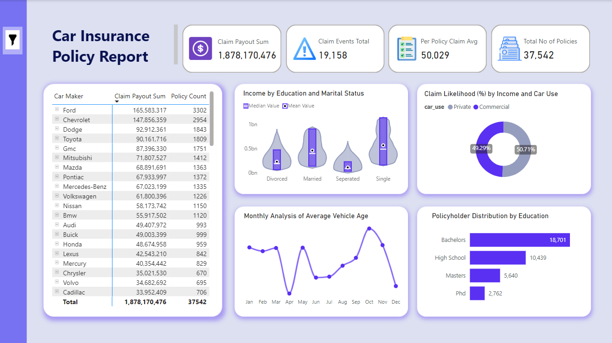

# Dangote-Datathon-Project

## Introduction
The Car Insurance Datathon project aimed to analyze a comprehensive dataset of insurance policies to uncover actionable insights that can help insurance companies improve decision-making, enhance customer satisfaction, and optimize risk management. The dataset included detailed information about policyholders, vehicles, and claims, offering a rich foundation for analysis.

The project's objectives were to:

Identify key trends and patterns in policyholder behavior, vehicle characteristics, and claims.
Develop metrics and visualizations to quantify and communicate these insights effectively.
Provide data-driven recommendations for risk segmentation, pricing strategies, and operational improvements.
Leveraging Power BI, the analysis incorporated advanced techniques for data cleaning, metric creation, and visualization. The project outcomes are expected to serve as a framework for improving underwriting processes, designing customer-centric products, and driving profitability for insurance providers.

**_Disclaimer_** The dataset used in this project is fictional and does not represent the data or operations of any specific insurance company or organization. The analysis, insights, and recommendations derived are purely for educational and illustrative purposes within the context of the Dangote datathon. Any resemblance to real-world scenarios or entities is purely coincidental.

## Problem Statement
Insurance companies face challenges in managing risks, optimizing pricing models, and improving operational efficiency due to the complexity of policyholder demographics, vehicle characteristics, and claim trends. The need for actionable insights from large, multi-dimensional datasets further compounds these challenges.

This project seeks to address the following key problems:

1.  Risk Assessment: Identifying high-risk policyholders and vehicles to improve underwriting and pricing strategies.
2.  Operational Efficiency: Understanding claims patterns to optimize resource allocation and streamline claims management processes.
3.  Customer Insights: Analyzing demographic and behavioral trends to design customer-centric products and services.
4.  Data-Driven Decision Making: Leveraging advanced analytics and visualization techniques to uncover actionable insights from raw data.
The goal is to provide a structured, data-driven approach to addressing these challenges, empowering insurance companies to enhance profitability and customer satisfaction.

## Dataset Overview
The project dataset was initially a flat file containing detailed information about policyholders, vehicles, and claims. To enhance the analysis, a date table was created and joined with the insurance policy data, forming a one-to-many relationship. This model allowed for time-based insights and improved granularity in trend analysis.

**Key components of the dataset included:**

- Policyholder Details: Gender, marital status, household income, and education level.
- Vehicle Information: Vehicle age (calculated from the car year), usage type, and other attributes.
- Claims Data: Claim frequency, claim amounts, and coverage zone impacts.
- This structured data model supported advanced calculations and more robust Power BI visualizations.

## Visualizations
To effectively communicate insights, a range of Power BI visuals were utilized, including:

**Card Visuals:** Displayed key performance indicators (KPIs), such as:
- Claim Payout Sum
- Claim Events Total
- Per Policy Claim Average
- Total Number of Policies

**Violin Plot:** Illustrated the relationship between household income and education, highlighting mean and median values to better understand distributions.

**Line Chart:** Showed the monthly trend of the average vehicle age, revealing seasonal patterns or time-based variations.

**Donut Chart:** Presented insights on:
  - Car Use distribution.
  - Claim Likelihood Percentage by income level, helping to identify high-risk income segments.

**Clustered Bar Chart:** Showed policyholder academic distribution alongside education levels, offering a detailed view of education-based risk profiles.

**Matrix Chart:** Portrayed relationships between:
  - Car Maker, Coverage Zone, and Education, with values such as Claim Payout Sum and Policy Count to provide a multidimensional perspective.

**Filter (Funnel Icon):** Included an interactive filter that allows users to filter insights by:

  - Year
  - Month
  - Car Maker
  - Coverage Zone

These visuals, coupled with the interactive filtering feature, ensured clear communication of complex insights and allowed stakeholders to explore the data dynamically to uncover specific trends or patterns.

## Insights
Key insights derived from the analysis include:
- High-risk policyholders include single individuals, males, and owners of older vehicles.
- Urban coverage zones contribute the highest claims, emphasizing zone-specific pricing models.
- Middle-income households file the highest claims, influencing targeted strategies.
- Policyholders with higher education levels have fewer claims, suggesting lower risk.
- Older vehicles (10+ years) are associated with higher claim amounts and frequencies.
- Only 25% of policyholders filed claims, indicating potential for optimized pricing.
- Visual storytelling with advanced Power BI visuals enhanced insight communication.

## Challenges
Challenges encountered during the project included:
1. Data Cleaning: Addressing missing and inconsistent values.
2. Data Integration: Ensuring accurate joins across multiple tables.
3. Complex Calculations: Developing advanced DAX measures for metrics like vehicle age and claims per coverage zone.
4. Visualization Customization: Creating intuitive visuals to represent multidimensional data.
5. Result Interpretation: Avoiding misinterpretation by validating trends through deeper analysis.

## Conclusion
This project demonstrated the potential of data analytics in transforming raw data into actionable insights. Key outcomes include:

- Identification of high-risk policyholders and vehicles.
- Insights into geographic and demographic claim trends for better pricing models.
- Recommendations for optimizing operational efficiency and policy utilization.
These findings offer a foundation for insurance companies to refine risk management, design customer-centric products, and improve profitability.

You can interact with the report [here](https://app.powerbi.com/groups/me/reports/812a9286-9d8c-438c-b6e1-49e3f8bea981/f3f564edba0a110e9d4e?experience=power-bi)

